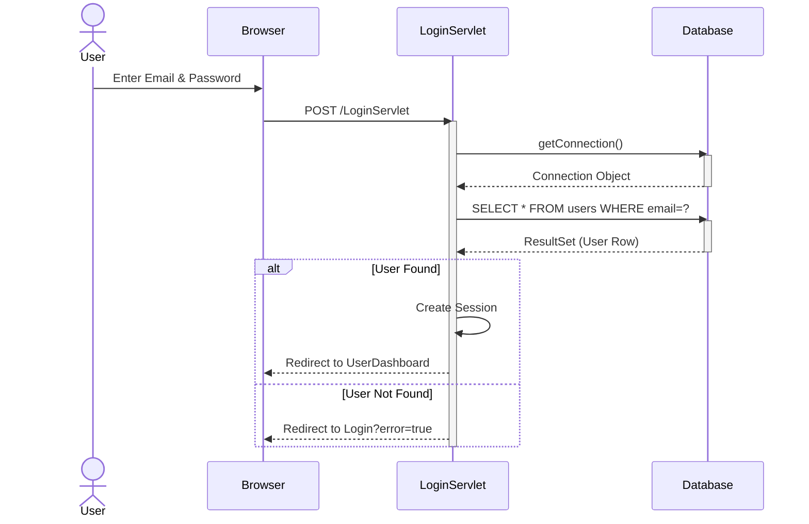
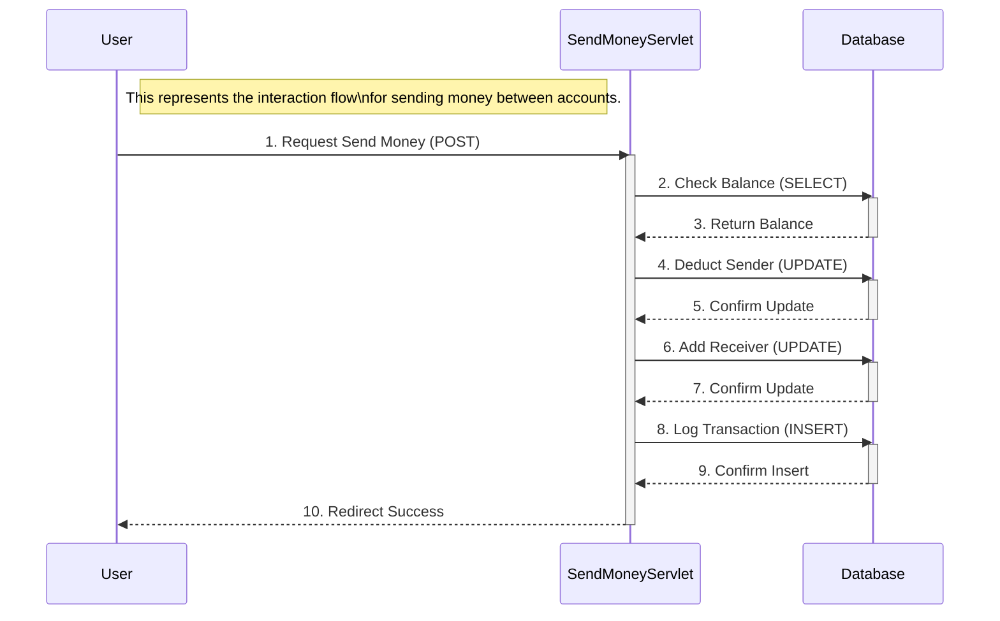
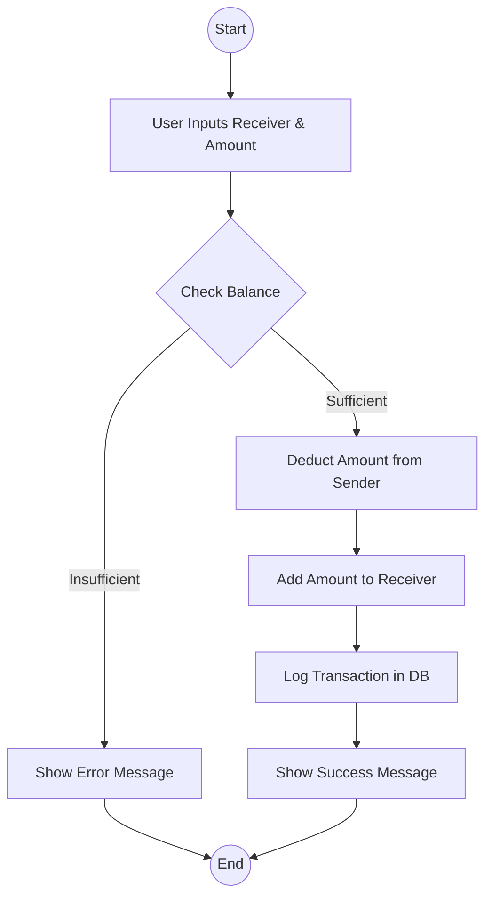
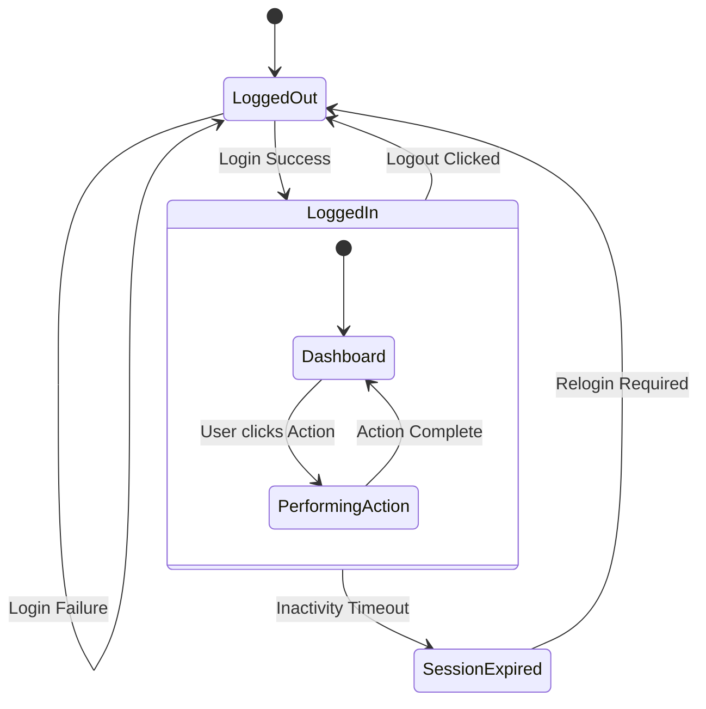

# Bank Management System - UML Diagrams

This document contains the UML diagrams for the Bank Management System project.

## 1. Use Case Diagram

```mermaid
usecaseDiagram
    actor "Customer" as User
    actor "Administrator" as Admin

    package "Banking System" {
        usecase "Login" as UC1
        usecase "Register" as UC2
        usecase "Logout" as UC3
        
        usecase "View Dashboard" as UC4
        usecase "Update Profile" as UC5
        usecase "Send Money" as UC6
        usecase "View Transaction History" as UC7
        
        usecase "Admin Dashboard" as UC8
        usecase "View All Customers" as UC9
        usecase "Manage Transactions" as UC10
        usecase "Edit Customer" as UC11
        usecase "Delete Customer" as UC12
        usecase "Add Customer" as UC13
        usecase "View All Transactions" as UC14
    }

    User --> UC1
    User --> UC2
    User --> UC3
    User --> UC4
    User --> UC5
    User --> UC6
    User --> UC7

    Admin --> UC1
    Admin --> UC3
    Admin --> UC8
    Admin --> UC9
    Admin --> UC10
    Admin --> UC11
    Admin --> UC12
    Admin --> UC13
    Admin --> UC14
```

## 2. Class Diagram


## 3. Sequence Diagram (Login Scenario)



## 4. Collaboration Diagram (Send Money Scenario)



## 5. Activity Diagram (Transaction Process)



## 6. State Chart Diagram (User Session State)



## 7. Component Diagram

```mermaid
componentDiagram
    component "Web Browser" as Client
    
    package "Bank Management System" {
        component "Authentication Module" as Auth
        component "User Services" as UserMod
        component "Admin Services" as AdminMod
        component "Database Utility" as DBUtil
    }
    
    component "MySQL Database" as DB
    
    Client --> Auth : Login/Register
    Client --> UserMod : Transaction/Profile
    Client --> AdminMod : Manage Users
    
    Auth ..> DBUtil : uses
    UserMod ..> DBUtil : uses
    AdminMod ..> DBUtil : uses
    
    DBUtil --> DB : JDBC Connection
```

## 8. Deployment Diagram

```mermaid
graph TD
    node1["Client Workstation\n(OS: Windows/Mac/Linux)"] {
        subgraph BrowserContainer [Web Browser]
            UI[HTML/JSP Pages]
        end
    }
    
    node2["Web Server\n(Apache Tomcat 9.0)"] {
        subgraph WebContainer [Web Container]
            Servlet[Java Servlets]
        end
    }
    
    node3["Database Server\n(MySQL 8.0)"] {
        DB[(Bank DB)]
    }
    
    UI -- "HTTP/HTTPS" --> Servlet
    Servlet -- "JDBC (TCP/IP)" --> DB
```
