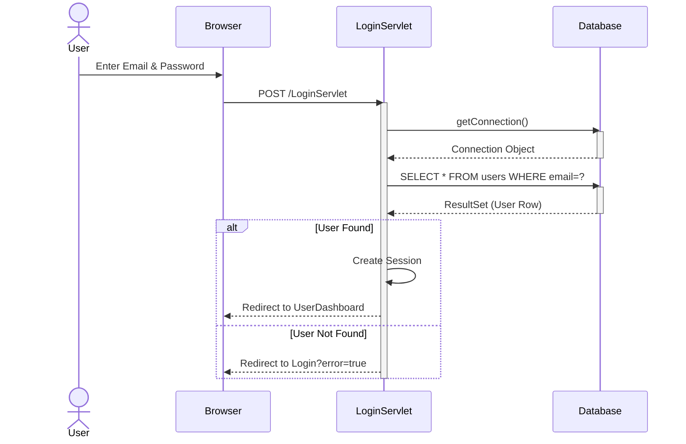
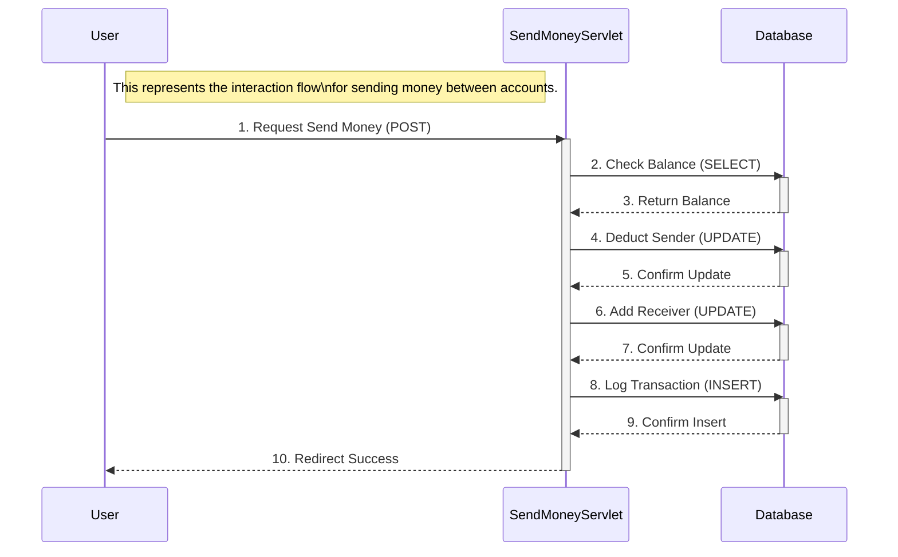
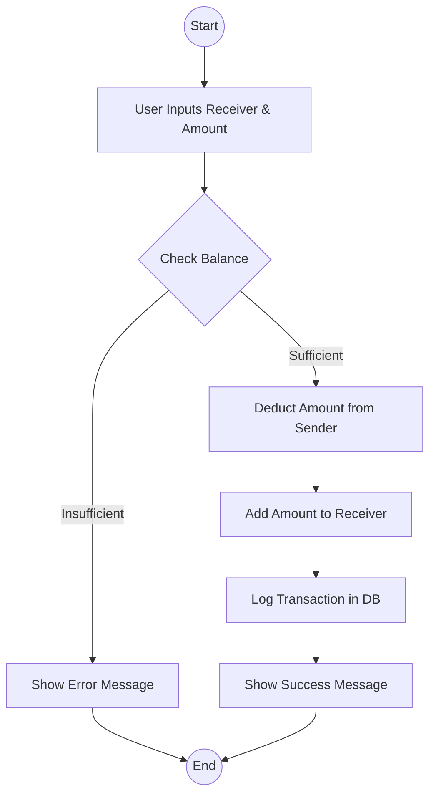
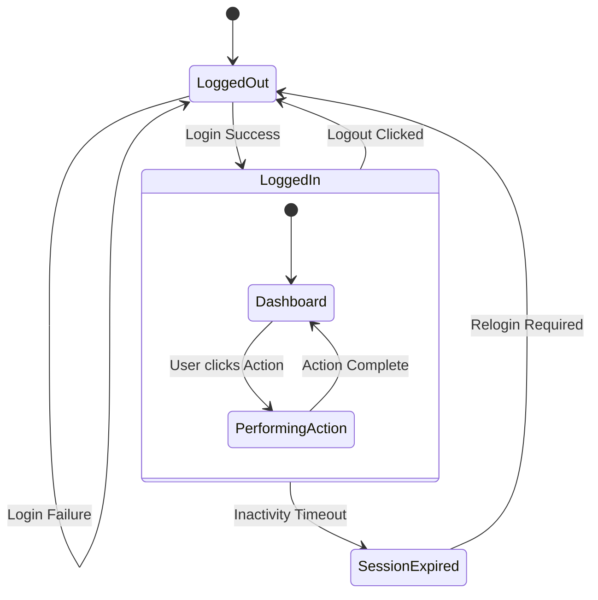

# Bank Management System - FSE Project Report

## 1. Introduction
The Bank Management System is a web-based application designed to facilitate seamless banking operations for both customers and administrators. Built using Java Servlets, JSP, and JDBC, it provides a robust platform for managing user accounts, transactions, and profile updates. The system aims to bridge the gap between traditional manual banking and modern digital solutions by providing an automated, secure, and user-friendly interface.

## 2. Problem Statement
Traditional banking systems often face challenges such as:
- **Scalability Issues**: Manual record-keeping is prone to errors and difficult to scale as the customer base grows.
- **Access Constraints**: Customers often need to visit physical branches for basic tasks like checking balances or transferring funds.
- **Security Risks**: Physical ledgers and non-digitized data are vulnerable to loss, theft, and unauthorized access.
- **Inefficiency**: Processing transactions manually takes significant time, leading to long queues and customer dissatisfaction.

## 3. Objectives
The primary objectives of this project are:
- To develop a secure and efficient digital platform for banking transactions.
- To automate account management and record-keeping processes.
- To enable customers to perform balance inquiries and fund transfers remotely.
- To provide administrators with a centralized dashboard for managing customers and monitoring system activity.

## 4. Scope
The scope of this project includes:
- **User Authentication**: Secure login and registration for Customers and Admins.
- **Customer Features**: Dashboard, balance inquiry, money transfer (P2P), profile updates, and transaction history.
- **Admin Features**: Dashboard with system statistics, customer management (Add/Edit/Delete), and global transaction monitoring.
- **Database Integration**: Reliable storage of user, customer, and transaction data using MySQL.
- **Exclusions**: Real-world payment gateway integration and multi-currency support are outside the current scope.

## 5. Beneficiary
- **Customers**: Benefit from 24/7 access to banking services, ease of fund transfers, and real-time balance tracking.
- **Bank Administrators**: Benefit from automated tools to manage large volumes of customer data and oversee financial activities efficiently.
- **Financial Institutions**: Can reduce operational costs and improve service delivery speed through automation.

## 6. Functional Requirements
- **FR1: User Authentication**: The system shall allow users to register and log in based on their roles (Admin/Customer).
- **FR2: Account Management**: Admins shall be able to create, update, and delete customer accounts.
- **FR3: Fund Transfer**: Customers shall be able to send money to other registered accounts.
- **FR4: Balance Inquiry**: Customers shall be able to view their current account balance on their dashboard.
- **FR5: Transaction Logging**: Every transaction (deposit, withdrawal, transfer) must be recorded in the database.
- **FR6: Profile Management**: Users shall be able to update their personal information (phone, address, password).

## 7. Non-Functional Requirements
- **Security**: All user passwords should be handled securely, and session management should prevent unauthorized access.
- **Usability**: The interface should be intuitive, allowing users to navigate without extensive training.
- **Performance**: The system should handle concurrent requests efficiently with minimal response time.
- **Reliability**: Data integrity must be maintained during transactions, ensuring that funds are correctly debited and credited.
- **Scalability**: The system architecture should allow for future additions, such as loan management or credit card services.

## 8. UML Models
This section provides a visual representation of the system's architecture and behavioral flow.

### 8.1 Use Case Diagram

```mermaid
usecaseDiagram
    actor "Customer" as User
    actor "Administrator" as Admin

    package "Banking System" {
        usecase "Login" as UC1
        usecase "Register" as UC2
        usecase "Logout" as UC3
        
        usecase "View Dashboard" as UC4
        usecase "Update Profile" as UC5
        usecase "Send Money" as UC6
        usecase "View Transaction History" as UC7
        
        usecase "Admin Dashboard" as UC8
        usecase "View All Customers" as UC9
        usecase "Manage Transactions" as UC10
        usecase "Edit Customer" as UC11
        usecase "Delete Customer" as UC12
        usecase "Add Customer" as UC13
        usecase "View All Transactions" as UC14
    }

    User --> UC1
    User --> UC2
    User --> UC3
    User --> UC4
    User --> UC5
    User --> UC6
    User --> UC7

    Admin --> UC1
    Admin --> UC3
    Admin --> UC8
    Admin --> UC9
    Admin --> UC10
    Admin --> UC11
    Admin --> UC12
    Admin --> UC13
    Admin --> UC14
```

### 8.2 Class Diagram

```mermaid
classDiagram
    class DatabaseConnection {
        +getConnection() Connection
    }

    class HttpServlet {
        <<Abstract>>
    }

    namespace Servlets {
        class LoginServlet
        class RegisterServlet
        class LogoutServlet
        class UserDashboardServlet
        class AdminDashboardServlet
        class SendMoneyServlet
        class UpdateProfileServlet
        class ViewCustomersServlet
        class ManageTransactionServlet
        class EditCustomerServlet
        class DeleteCustomerServlet
        class AddCustomerServlet
        class ViewTransactionsServlet
        class AdminViewTransactionsServlet
    }

    namespace Entities {
        class User {
            +int id
            +String email
            +String password
            +String role
        }

        class Customer {
            +int id
            +int userId
            +String name
            +String address
            +String phone
            +String accountNumber
            +double balance
        }

        class Transaction {
            +int id
            +String senderAccount
            +String receiverAccount
            +double amount
            +String type
            +TimeStamp timestamp
        }
    }

    LoginServlet --|> HttpServlet
    RegisterServlet --|> HttpServlet
    UserDashboardServlet --|> HttpServlet
    AdminDashboardServlet --|> HttpServlet
    SendMoneyServlet --|> HttpServlet
    
    LoginServlet ..> DatabaseConnection : uses
    RegisterServlet ..> DatabaseConnection : uses
    UserDashboardServlet ..> DatabaseConnection : uses
    
    User "1" -- "1" Customer : has
    Customer "1" -- "*" Transaction : initiates
```



### 8.3 Sequence Diagram (Login Scenario)



### 8.4 Collaboration Diagram (Send Money Scenario)



### 8.5 Activity Diagram (Transaction Process)



### 8.6 State Chart Diagram (User Session State)



### 8.7 Component Diagram

```mermaid
componentDiagram
    component "Web Browser" as Client
    
    package "Bank Management System" {
        component "Authentication Module" as Auth
        component "User Services" as UserMod
        component "Admin Services" as AdminMod
        component "Database Utility" as DBUtil
    }
    
    component "MySQL Database" as DB
    
    Client --> Auth : Login/Register
    Client --> UserMod : Transaction/Profile
    Client --> AdminMod : Manage Users
    
    Auth ..> DBUtil : uses
    UserMod ..> DBUtil : uses
    AdminMod ..> DBUtil : uses
    
    DBUtil --> DB : JDBC Connection
```

### 8.8 Deployment Diagram

```mermaid
graph TD
    node1["Client Workstation\n(OS: Windows/Mac/Linux)"] {
        subgraph BrowserContainer [Web Browser]
            UI[HTML/JSP Pages]
        end
    }
    
    node2["Web Server\n(Apache Tomcat 9.0)"] {
        subgraph WebContainer [Web Container]
            Servlet[Java Servlets]
        end
    }
    
    node3["Database Server\n(MySQL 8.0)"] {
        DB[(Bank DB)]
    }
    
    UI -- "HTTP/HTTPS" --> Servlet
    Servlet -- "JDBC (TCP/IP)" --> DB
```

## 9. Conclusion
The Bank Management System successfully demonstrates the application of software engineering principles in building a functional, secure, and scalable banking solution. By automating core processes such as account management and fund transfers, the system addresses the inefficiencies of traditional banking. The modular design, supported by comprehensive UML modeling, ensures that the system is both maintainable and extensible for future enhancements. This project serves as a cornerstone for understanding the integration of web technologies with database management in a real-world financial context.

