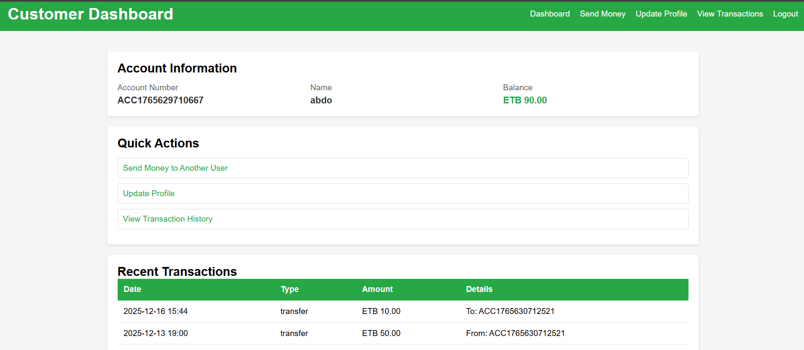

A web-based banking system where:
Users can create accounts, log in, view balances, send money, and view transaction history
Admins can manage customers (add, edit, delete) and view all transactions
Data is stored in a MySQL database

## Screenshots

### Login Page

### Admin

### User/Customer

